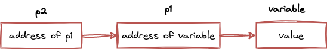
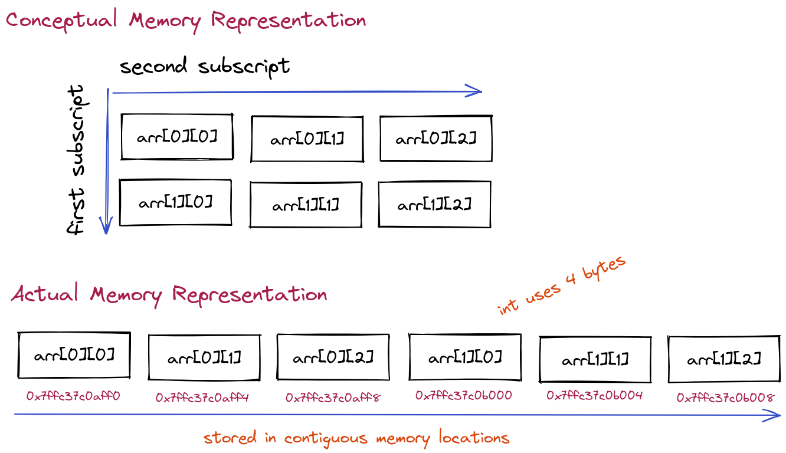

<h1 align="center">0x07. C - Even more pointers, arrays and strings</h1>

Table Of Contents
- [Notes](#notes)
    - [Double Pointers](#double-pointers)
    - [2D Arrays In C](#2d-arrays)


### Notes


#### Double Pointers 

> A **pointer to a pointer** or **A Double Pointer** is a pointer that holds the address of another pointer.

- It's a form of multiple indirection, or a chain of pointers.



A variable that is a pointer to a pointer must be declared with `**`.

```c
int **p2;
```

Example:
```c
#include <stdio.h>

int main () {
    int variable;
    int *p1;
    int **p2; /* declaring a double pointer */

    variable = 3000;

    p1 = &variable; /* store address of variable into p1 */
    p2 = &p1; /* store address of p1 into p2*/

    /* accessing value of variable */
    printf("variable = %d\n", variable);
    printf("value of variable using p1 = %d\n", *p1);
    printf("value of variable using p2 = %d\n", **p2);

    /* accessing address of variable */
    printf("Addres of variable = %p\n", &variable);
    printf("Address of variable using p1 = %p\n", p1);
    printf("Address of variable using p2 = %p\n", *p2);    

    /* accessing value of p1 */
    printf("Value of Pointer p1 = %p\n", p1);
    printf("Value of Pointer p1 using p2 = %p\n", *p2);

    /* accessing address of p1 */
    printf("Addres of Pointer p1 = %p\n", &p1);
    printf("Address of Pointer p1 using p2 = %p\n", p2);

    /* accessing double pointer value and address */
    printf("Value of Pointer p2 = %p\n", p2);
    printf("Address of Pointer p2 = %p\n",&p2);  

    return 0;
}
```
Possible Output:
```
variable = 3000
value of variable using p1 = 3000
value of variable using p2 = 3000

Addres of variable = 0x7ffc331969b4
Address of variable using p1 = 0x7ffc331969b4
Address of variable using p2 = 0x7ffc331969b4

Value of Pointer p1 = 0x7ffc331969b4
Value of Pointer p1 using p2 = 0x7ffc331969b4

Addres of Pointer p1 = 0x7ffc331969b8
Address of Pointer p1 using p2 = 0x7ffc331969b8

Value of Pointer p2 = 0x7ffc331969b8
Address of Pointer p2 = 0x7ffc331969c0
```
To put it simply: 
```
variable == *p1 == **p2
&variable == p1 == *p2
             &p1 == p2
```


#### 2D Arrays

> A **2D Array** (aka **Matrix**) is an array of arrays, represented by a table of rows and columns.



##### Initialization

```c
// more readable
int arr[2][3] = {
    {10, 11, 12},
    {13, 14, 15}
};
```
or 
```c
// [2], [3] known as first subscript and second subscript, respectively.
int arr[2][3] = {10, 11, 12, 13, 14, 15};
```

Unlike a normal array, with 2D arrays we need to specify the size of the second diemnsion.

```c
int arr[2][3] = {10, 11, 12, 13, 14, 15}; // valid
int arr[][3] = {10, 11, 12, 13, 14, 15}; // valid
int arr[][] = {10, 11, 12, 13, 14, 15}; // Invalid
int arr[2][] = {10, 11, 12, 13, 14, 15}; // Invalid
```

##### Example 

```c
#include <stdio.h>

int main()
{
    int arr[2][4]; // declaration
    int i, j; // counter variables 
    
    for(i = 0; i < 2; i++){
        for(j = 0; j < 3; j++){
            
            printf("Enter value for arr[%d][%d]: ", i, j);
            scanf("%d", &arr[i][j]);
        }
    }
    
    printf("Two Dimensional array elements:\n");
    for(i = 0; i < 2; i++){
        for(j = 0; j < 3; j++){
            printf("%d ", arr[i][j]);
            
            // for output readability 
            if(j == 2){
                printf("\n");
            }
        }
    }
}
```

##### Pointers & 2D arrays

1D-array name works as a pointer to the base element of the array:
```c
int x[10];
x[0] = 5;
    
printf("x = %p\n", x); // x = 0x7ffce444aab0
printf("*x = %d\n", *x); // *x = 5
```

However, This isn't the case with 2D arrays.
```c
int y[2][3] = {10, 11, 12, 13, 14, 15};
    
printf("y[0] = %d\n", y[0]); // address of first element of first row
printf("y[1] = %d\n", y[1]); // address of first element of second row
```

